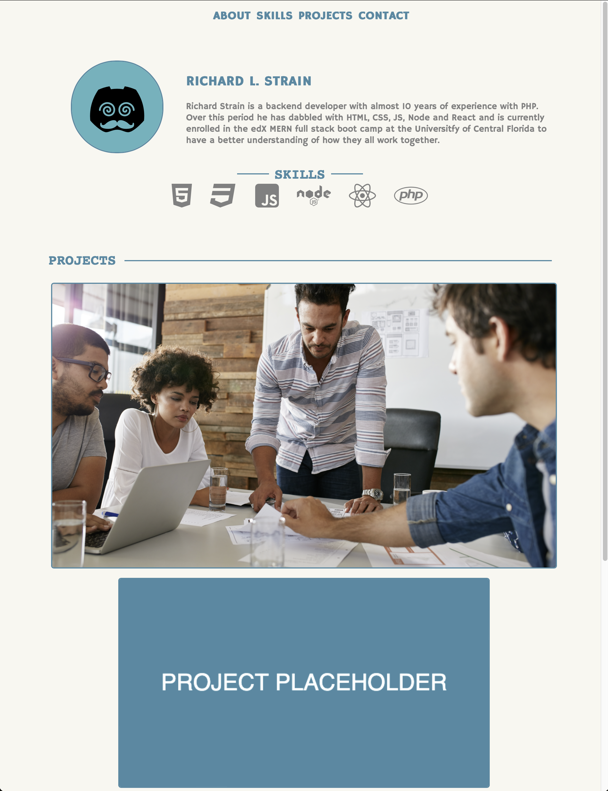

# Bootcamp Project Portfolio

## Description

This is the Week 2 challenge where we are tasked creating a portfolio website to showcase our projects to potential employers and it should include the following.

- The developer's name and a recent photo or avatar.
- Navigation link should scroll the page to the corresponding section.
- Projects/Work Should scroll to a section with titled images.
- The first project image should be larger than the others.
- Project images should be linked to the deployed applications.
- The portfolio page should be responsive and adapt to different viewport sizes.

## Deployed URL

- https://rich-strain.github.io/project-portfolio/

## Screenshot

